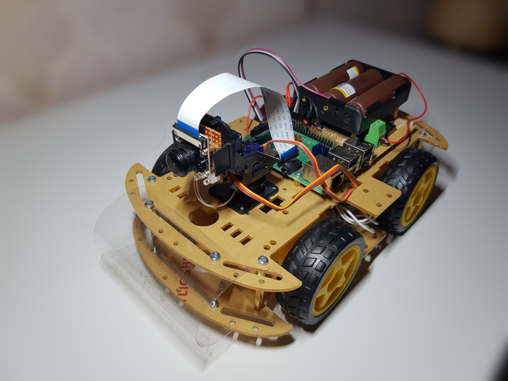
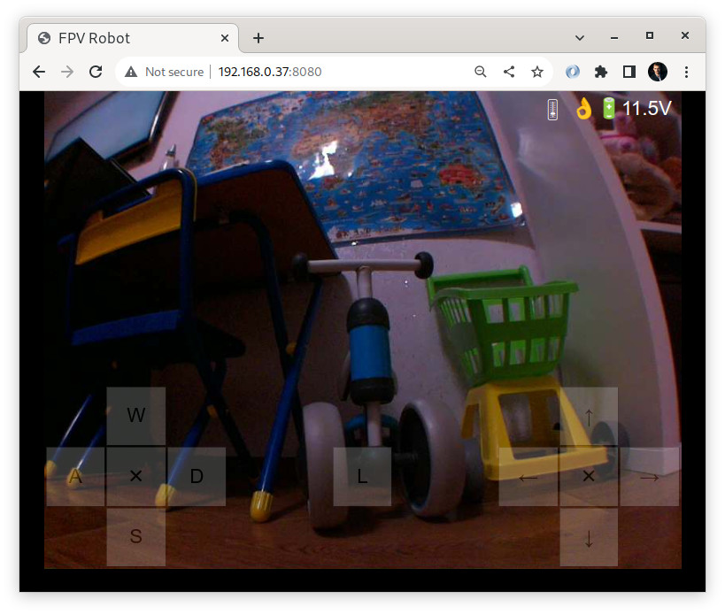

=========
FPV Robot
=========

This repository contains schematic and software to build 4WD FPV robot/car
based on Raspberry Pi and Arduino. The robot is controlled via a web interface
using Wi-Fi.

Hardware
========

The 4WD robot car platform is used as chassis. The Raspberry Pi with camera
module is used to run web server and stream video. The Arduino Pro Mini is used
to control motors, servos, lighting and read batteries voltage level. Arduino
is connected with Raspberry Pi via serial connection (UART).

Schematic in `schematic.pdf <schematic.pdf>`_.

Supplies:

* 4WD Mobile Platform for Arduino Smart Robot Car
  [https://www.elecrow.com/4wd-mobile-platform-for-arduino-smart-robot-car-p-1531.html]
* Raspberry Pi 3 Model B+
* Raspberry Pi Camera Module
* Micro SD memory card
* Arduino Pro Mini 3.3v ATmega328P
* MX1508 Dual DC Motor Driver Module
* Pan and Tilt Stand
  [https://www.electromaker.io/shop/product/assemb-mini-pan-tilt-kit-wmicro-servos]
* 2x SG90 Servo
* LM2596S Step Down DC Converter
* MP1584EN Step Down DC Converter
* AMS1117 5.0V (module or single chip)
* AMS1117 3.3V (module or single chip)
* 3S 18650 Batteries Holder Case
* 3x 18650 Li-Ion Batteries
* 30K resistor
* 10K resistor
* 3K resistor
* NPN Transistor 2N2222A
* 2x 10mF capacitor (if using AMS1117 as single chip)
* 2x 22mF capacitor (if using AMS1117 as single chip)
* 5x 3mm LEDs
* Wires, screws, PCBs, etc.

Software
========

  * The ``ard1`` directory contains Arduino sketch
  * The ``fpvrobotrpiserver`` directory contains web server application written
    in Python/aiohttp to run on Raspberry Pi

Arduino sketch
--------------

The Arduino sketch requires `servo library <https://www.arduino.cc/reference/en/libraries/servo/>`_.

Web server
----------

To run web server application on Raspberry Pi firstly download and install
Raspberry Pi OS to memory card. Then configure Wi-Fi and enable SSH. Determine
Raspberry Pi IP address using `sudo ip addr`. Connect via SSH and install
these packages:

.. code::

   sudo apt install git \
                    python3-aiohttp \
                    python3-aiohttp-jinja2 \
                    python3-picamera2 \
                    python3-pip \
                    python3-serial

Then install aioserial:

.. code::

   sudo pip3 install aioserial

Clone this repository:

.. code::

   git clone git@github.com:lostclus/FPVRobot.git 

Run application:

.. code::

   cd FPVRobot
   python3 -m fpvrobotrpiserver

Then in other device that connected to same local network open web browser and
go to http://<IP>:8080
